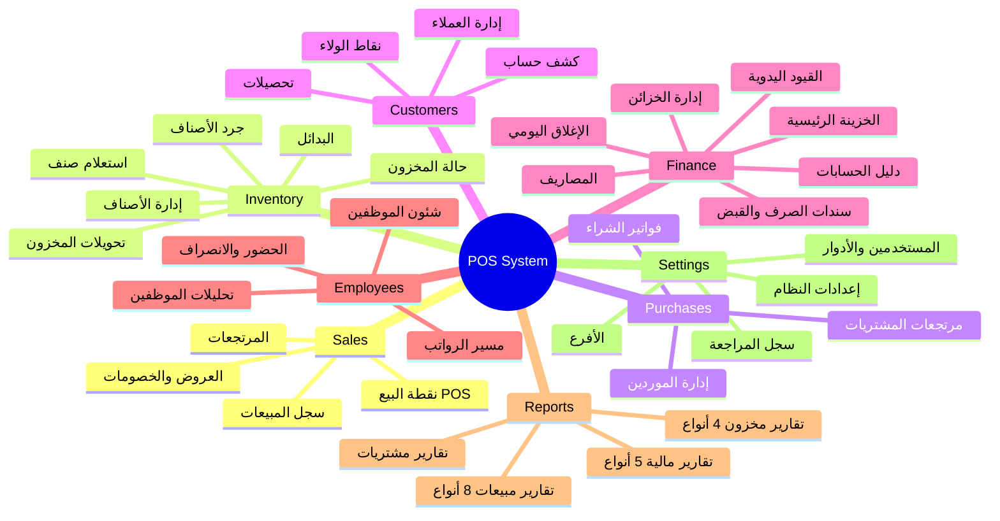
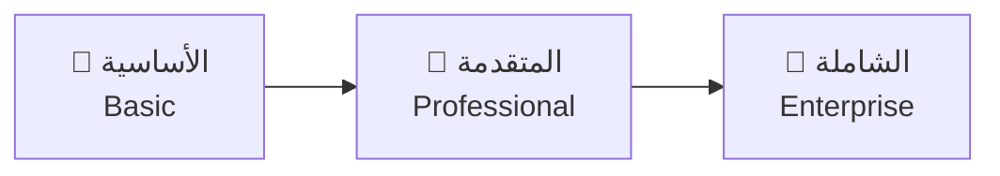
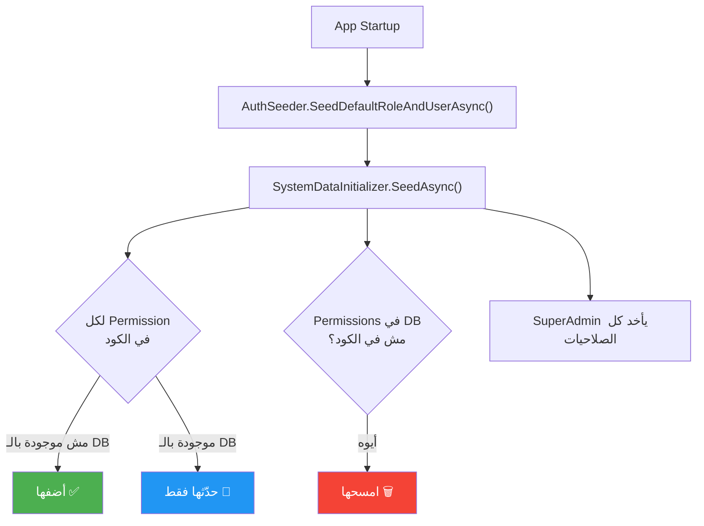

# 🏗️ تحليل مشروع LanaSoft POS - التسعير والموديولز

## 📊 ملخص المشروع

| البند | التفاصيل |
|---|---|
| **النوع** | نظام نقاط بيع (POS) متكامل |
| **Backend** | ASP.NET Core + SQL Server / SQLite |
| **Frontend** | Angular 19 (Standalone Components) |
| **التوزيع** | Web App + Electron Desktop |
| **الأمان** | JWT + RSA License + Anti-Tamper (4 طبقات) |
| **قاعدة البيانات** | SQL Server (ويب) / SQLite (إلكترون) |
| **Multi-Branch** | ✅ نعم - عزل بيانات كامل بالفروع |

---

## 🧩 الموديولز الأساسية (8 موديولز رئيسية)



---

## 📋 تفصيل الموديولز والصلاحيات (90+ صلاحية)

### 1. 🛒 المبيعات (Sales)
| الصلاحية | الكود | نوعها |
|---|---|---|
| نقطة البيع | `sales.pos` | قائمة |
| تغيير سعر البيع | `sales.edit-price` | فرعية |
| سجل المبيعات | `sales.history` | قائمة |
| حذف فاتورة | `sales.delete` | فرعية |
| إعادة طباعة | `sales.print` | فرعية |
| مرتجع مبيعات | `sales.returns.add` | فرعية |
| سجل المرتجعات | `sales.returns` | قائمة |
| العروض والخصومات | `promotions.list` | قائمة |

### 2. 📦 المخزون (Inventory)
| الصلاحية | الكود | نوعها |
|---|---|---|
| الأصناف (عرض/إضافة/تعديل/حذف) | `products.*` | قائمة + فرعية |
| استعلام صنف | `products.inquiry` | قائمة |
| البدائل | `products.alternatives` | قائمة |
| حالة المخزون | `inventory.list` | قائمة |
| تحويلات المخزون | `inventory.transfer` | قائمة |
| جرد الأصناف | `inventory.stocktake` | قائمة |

### 3. 🚚 المشتريات (Purchases)
| الصلاحية | الكود | نوعها |
|---|---|---|
| فواتير الشراء | `purchases.list` | قائمة |
| مرتجع شراء | `purchases.return` | فرعية |
| مرتجعات المشتريات | `purchases.return-history` | قائمة |
| الموردين | `suppliers.list` | قائمة + فرعية |

### 4. 👥 العملاء (Customers)
| الصلاحية | الكود | نوعها |
|---|---|---|
| العملاء | `customers.list` | قائمة |
| كشف حساب عميل | `customers.statement` | فرعية |
| تحصيلات العملاء | `customers.payments` | فرعية |

### 5. 💰 المالية (Finance)
| الصلاحية | الكود | نوعها |
|---|---|---|
| الخزينة الرئيسية | `finance.vault` | قائمة |
| إدارة الخزائن | `finance.treasury.manage` | قائمة |
| دليل الحسابات | `finance.accounting` | قائمة |
| المصاريف | `finance.expenses` | قائمة |
| سندات الصرف | `finance.vouchers` | قائمة |
| سندات القبض | `finance.receipts` | قائمة |
| الإغلاق اليومي | `finance.daily-closing` | قائمة |
| القيود اليدوية | `finance.journal` | قائمة |

### 6. 👨‍💼 شئون العاملين (Employees/HR)
| الصلاحية | الكود | نوعها |
|---|---|---|
| شئون الموظفين | `employees.manage` | قائمة |
| الحضور والانصراف | `employees.attendance` | قائمة |
| شاشة تسجيل الحضور | `employees.attendance_kiosk` | قائمة |
| مسير الرواتب | `employees.payroll` | قائمة |
| تحليلات الموظفين | `employees.analytics` | قائمة |
| تقرير ساعات العمل | `reports.attendance` | قائمة |

### 7. 📊 التقارير (Reports) - 18+ تقرير
- تقارير مبيعات (يومي، ورديات، شهري، الأكثر مبيعاً، تحليلات عملاء، طرق دفع، مرتجعات، نقاط ولاء)
- تقارير مخزون (جرد، كارت صنف، نواقص، صلاحية)
- تقارير مشتريات (تحليلات موردين، مرتجعات مشتريات)
- تقارير مالية (دفتر أستاذ، أرباح وخسائر، ميزانية عمومية، ميزان مراجعة، ربحية)

### 8. ⚙️ الإعدادات (Settings)
- المستخدمين والأدوار والصلاحيات
- إعدادات النظام
- الأفرع
- سجل المراجعة (Audit Logs)

---

## 💵 تقدير الأسعار - اشتراك سنوي

### النموذج المقترح: Tiered Module-Based Pricing



### الباقات المقترحة

| الباقة | الموديولز المشمولة | السعر السنوي المقترح (ج.م) |
|---|---|---|
| **🥉 الأساسية** | المبيعات + المخزون + الإعدادات | **6,000 - 8,000** |
| **🥈 المتقدمة** | الأساسية + المشتريات + العملاء + التقارير الأساسية | **10,000 - 13,000** |
| **🥇 الشاملة** | كل الموديولز (مالية + HR + تقارير متقدمة) | **15,000 - 18,000** |

### إضافات اختيارية (Add-ons)

| الإضافة | السعر السنوي (ج.م) |
|---|---|
| 🧑‍💼 موديول الموظفين (HR) | +2,000 - 3,000 |
| 💰 موديول المالية المتقدم (محاسبة كاملة) | +2,500 - 3,500 |
| 📊 التقارير المتقدمة (ميزانية + ميزان مراجعة + ربحية) | +1,500 - 2,000 |
| 🏢 فروع إضافية (لكل فرع) | +1,000 - 2,000 |
| 💻 أجهزة إضافية (زيادة عن 3) | +500 لكل جهاز |

### عوامل التسعير

> [!IMPORTANT]
> الأسعار دي تقديرية بناءً على:
> - حجم الكود وتعقيد النظام (90+ صلاحية، 23 Feature module في الباك إند)
> - نظام ترخيص متقدم (RSA + Anti-Tamper)
> - دعم Multi-Branch مع عزل بيانات كامل
> - نظام محاسبي متكامل (Chart of Accounts + Journal Entries)
> - أسعار السوق المصري للـ POS Systems

---

## 🔧 هل يفرق لو عميل أخد موديولز معينة وعميل لا؟

### ✅ أيوه، النظام **جاهز أصلاً** لده!

النظام عنده **طبقتين** للتحكم في الموديولز:

### الطبقة 1: License Features (على مستوى الرخصة)

الرخصة فيها `features` array في ملف الـ `.key`:

```json
{
  "licenseId": "LIC-2026-123456",
  "customerName": "محل أبو أحمد",
  "machineId": "XK7F-9M2P-4RTS",
  "maxDevices": 3,
  "features": ["pos", "inventory", "employees", "accounting", "reports", "customers"],
  "issuedAt": "2026-04-20",
  "expiresAt": "2027-04-20"
}
```

> [!TIP]
> لما تعمل رخصة لعميل معين، ممكن تحدد بالضبط الـ features اللي هياخدها:
> ```bash
> node generate-license.js --machine "XK7F" --name "محل أحمد" --months 12 --features "pos,inventory"
> ```
> ده هيدي العميل **بس** POS + Inventory.

### الطبقة 2: Roles & Permissions (على مستوى الصلاحيات)

النظام فيه **90+ صلاحية** يقدر الـ Admin يتحكم فيها لكل Role. بمعنى حتى لو العميل عنده الموديول، ممكن يمنع يوزرز معينين.

---

## ⚠️ المشكلة الحالية: مفيش Feature Enforcement في الباك إند!

> [!WARNING]
> **حالياً** النظام بيخزن الـ `features` في الرخصة وبيرجعها في الـ `LicenseStatusDto` للـ Frontend، **لكن** مفيش middleware أو guard بيمنع الوصول للـ API endpoints بناءً على الـ features.
> 
> يعني لو عميل عنده رخصة بـ `["pos"]` بس، هيقدر يدخل على API المشتريات عادي لأن مفيش check. 
> الـ `LicenseEnforcementMiddleware` بيتشيك بس إن الرخصة valid ولا لا، مش بيشيك الـ features.

### 🔨 الحلول المقترحة

#### الحل السريع: Frontend-Only Enforcement
- الـ Frontend يقرأ `features` من الـ `LicenseStatus`
- يخفي عناصر القائمة والصفحات اللي مش مشمولة
- **كافي لـ 90% من العملاء** خصوصاً في Electron

#### الحل الكامل: Backend Feature Middleware
إضافة `FeatureGuardMiddleware` في الباك إند يعمل check على كل endpoint:

```csharp
// مثال مقترح
[FeatureRequired("employees")]
public class EmployeeController : ControllerBase { ... }
```

---

## 🗑️ إزاي ألغي موديول من عند عميل؟

### الطريقة 1: عن طريق الرخصة (Electron فقط)
1. **عدّل الـ features** في ملف الرخصة الجديد
2. **أعد توليد** الرخصة بدون الموديول:
   ```bash
   node generate-license.js -m "XXXX" -n "محل أحمد" --features "pos,inventory"
   # ← شيلت employees, accounting, reports, customers
   ```
3. العميل يفعّل الرخصة الجديدة

### الطريقة 2: عن طريق الصلاحيات (Web & Electron)
1. **اعمل Role جديد** فيه بس الصلاحيات المسموحة
2. **غيّر الـ Role** بتاع كل المستخدمين عند العميل
3. القوائم والصفحات هتختفي تلقائياً

### الطريقة 3: حذف من الداتابيز (❌ مش مستحسن)

> [!CAUTION]
> **لا تمسح من الداتابيز مباشرة!** لأن:
> 1. الـ `AuthSeeder` → `SystemDataInitializer.SeedAsync()` بيشتغل **كل مرة** التطبيق يعمل startup
> 2. هو بيعمل **sync** لكل الصلاحيات - يعني لو مسحت صلاحية، هيرجعها تاني!
> 
> الكود واضح هنا:
> ```csharp
> // SystemDataInitializer.cs - Line 414-448
> if (perm == null)
> {
>     // ← هيعملها من جديد لو مش موجودة!
>     perm = new Permission { Code = mod.Code, ... };
>     context.Permissions.Add(perm);
> }
> ```

---

## 🔄 توضيح سلوك الـ AuthSeeder



### يعني:
- ✅ الـ Seeder **بيضيف** صلاحيات ناقصة
- 🔄 الـ Seeder **بيحدّث** بيانات الصلاحيات الموجودة
- 🗑️ الـ Seeder **بيمسح** صلاحيات **مش موجودة في الكود** (obsolete)
- 👑 الـ SuperAdmin **دايماً** بياخد كل الصلاحيات

> [!IMPORTANT]
> **الحل الصح**: مش عن طريق مسح من الداتابيز! لكن عن طريق:
> 1. **الرخصة** (features list) - للتحكم على مستوى العميل
> 2. **الأدوار** (Roles/Permissions) - للتحكم على مستوى المستخدم
> 
> الصلاحيات هتفضل موجودة في الداتابيز **بس** المستخدم مش هيقدر يوصلها.

---

## 📌 خطة التنفيذ للتسعير بالموديولز

### المطلوب عمله تقنياً:

| # | المهمة | الأولوية | الجهد |
|---|---|---|---|
| 1 | إضافة Feature Mapping (ربط الـ permission codes بالـ license features) | 🔴 عالية | يوم |
| 2 | إضافة `FeatureGuardMiddleware` في الباك إند | 🔴 عالية | يوم |
| 3 | تحديث الـ Frontend لإخفاء القوائم حسب الـ features | 🟡 متوسطة | يوم |
| 4 | إنشاء Admin Panel لإدارة الرخص | 🟢 منخفضة | 2-3 أيام |

### Feature → Permission Mapping المقترح:

```
pos        → sales.*, promotions.*
inventory  → products.*, inventory.*
purchases  → purchases.*, suppliers.*  (ممكن تدمجه مع inventory)
customers  → customers.*
accounting → finance.*, reports.financial.*
employees  → employees.*, reports.attendance
reports    → reports.*
```

---

## 🎯 التوصية النهائية

1. **ابدأ بـ 3 باقات** (أساسية / متقدمة / شاملة)
2. **استخدم نظام الرخص الموجود** لتحديد الـ features لكل عميل
3. **ضيف Feature Enforcement Middleware** عشان الحماية تكون من الباك إند
4. **ما تمسحش** من الداتابيز - استخدم الرخص والأدوار
5. **النظام واحد** لـ Electron والـ Web - الفرق بس في:
   - **Electron**: License file مطلوب + Trial System + Machine ID
   - **Web**: ممكن تعتمد على subscription في backend بداتابيز مركزية
